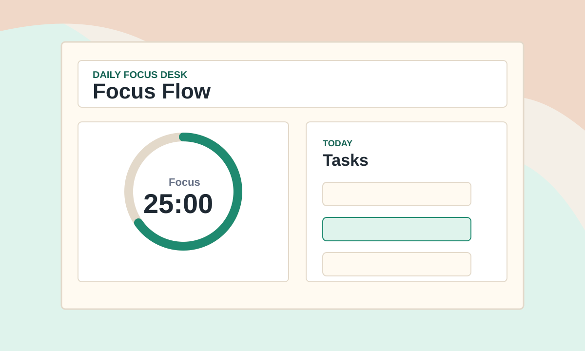

# Focus Flow

Focus Flow is a small focus timer for daily work sessions. It combines a Pomodoro-style timer, a simple task list, session stats, dark mode, and browser-based persistence.



## Features

- focus, short break, and long break timer modes;
- daily task list;
- completed task counter;
- focus session and minute stats;
- light and dark themes;
- local persistence with `localStorage`;
- responsive layout for desktop and mobile.

## Run Locally

Open `index.html` in a browser.

You can also start a local server:

```bash
python -m http.server 8080
```

Then open:

```text
http://localhost:8080
```

## Russian Notes

If you want a Russian explanation of the project, see [docs/README.ru.md](./docs/README.ru.md).

## Project Structure

```text
focus-flow/
├── assets/
│   └── preview.svg
├── docs/
│   └── README.ru.md
├── app.js
├── index.html
├── styles.css
└── README.md
```

## Ideas To Extend

- add a sound notification when the timer ends;
- export weekly focus stats;
- add drag-and-drop task sorting;
- add custom timer durations.

## License

MIT
